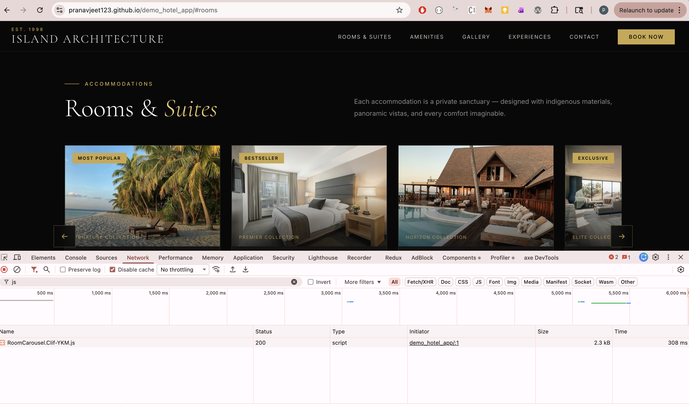

# Island Architecture — Hotel Demo

A luxury hotel landing page built with **Astro** to demonstrate **Island Architecture** — only interactive UI components load JavaScript. Everything else is zero-JS static HTML.

**Live demo:** https://pranavjeet123.github.io/demo_hotel_app/  
**Developed by:** [Pranavjeet Mishra](https://www.linkedin.com/in/pranavjeet/)  
**Stack:** Astro · React Islands · TypeScript

---

## What is Island Architecture?

Static HTML is shipped for the entire page at build time. JavaScript is loaded **only** for components that actually need it, and only **when they are needed**.

```
⬜ Static (zero JS)        🟦 client:load      🟩 client:visible     🟨 client:idle
─────────────────────────────────────────────────────────────────────────────────
About Section              MobileMenu          RoomCarousel          NewsletterForm
Amenities Section          HeroSlider          GalleryLightbox
Experiences Section        BookingWidget
Testimonials
Footer (layout)
```

---

## Run Locally

```bash
npm install
npm run dev        # http://localhost:4321
npm run build      # production build → dist/
npm run preview    # preview production build
```

---

## Selective Hydration in Action



---

## Validate Selective Hydration — Step by Step

### 1. Open Network Tab

1. Open `http://localhost:4321` in Chrome
2. `F12` → **Network** tab → filter by **JS**
3. Check **Disable cache**
4. Hard reload (`Cmd+Shift+R`)

**What you should see on initial load — only these files:**
```
client.js          ~135 kB   (React runtime, shared)
MobileMenu.js        ~4 kB   (nav needs JS immediately)
HeroSlider.js        ~3.6 kB (above-fold slider)
BookingWidget.js     ~6.3 kB (booking form — critical)
```

**These should NOT appear yet:**
```
✗ RoomCarousel.js      — not downloaded (you haven't scrolled there)
✗ GalleryLightbox.js   — not downloaded
✗ NewsletterForm.js    — not downloaded
```

---

### 2. Watch JS Load on Scroll

Keep the Network tab open and **slowly scroll down** the page.

| You scroll to | File that appears in Network |
|---|---|
| Rooms section | `RoomCarousel.js` (~5.8 kB) |
| Gallery section | `GalleryLightbox.js` (~4.0 kB) |
| Wait 2s idle | `NewsletterForm.js` (~1.5 kB) |

This proves JS is deferred until the component enters the viewport.

---

### 3. Check JS Coverage (Unused Code)

1. DevTools → `⋮` More tools → **Coverage**
2. Click record → reload → stop recording
3. Look at the JS files — coverage should be **>90% used**

A typical React SPA shows 40–60% unused JS on load. Islands Architecture eliminates dead code by only loading what's active.

---

### 4. Run Lighthouse

```bash
npx lighthouse http://localhost:4321 --view
```

Expected results:
```
Performance        ~92
Time to Interactive  ~1.1s
Total Blocking Time  ~20ms
First Contentful Paint ~0.4s
```

Enable **CPU 6x throttle** in DevTools Performance tab to simulate a mid-range Android phone — the page remains readable immediately because HTML is pre-rendered, not dependent on JS.

---

## Islands Reference

| Component | Directive | Why |
|---|---|---|
| `MobileMenu` | `client:load` | Nav toggle needed on page load |
| `HeroSlider` | `client:load` | Above-fold slider controls |
| `BookingWidget` | `client:load` | Critical booking form |
| `RoomCarousel` | `client:visible` | Below fold — deferred to scroll |
| `GalleryLightbox` | `client:visible` | Below fold — deferred to scroll |
| `NewsletterForm` | `client:idle` | Non-critical — loads when browser is free |
| All other sections | static | Pure HTML — zero JS ever |
